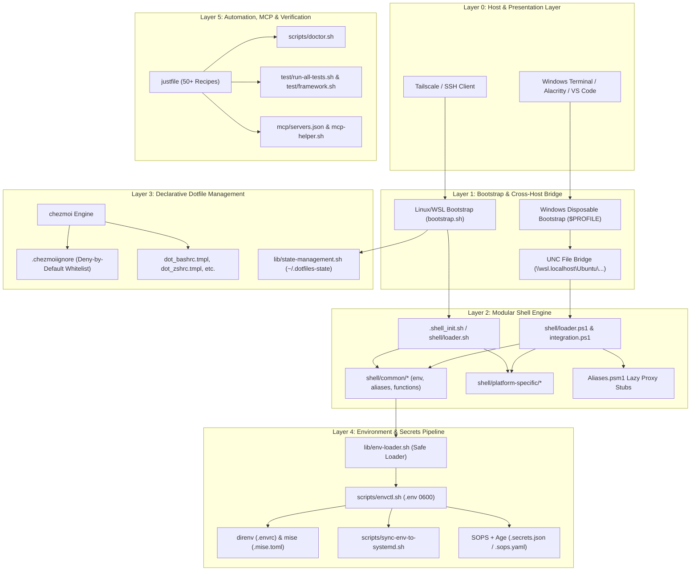
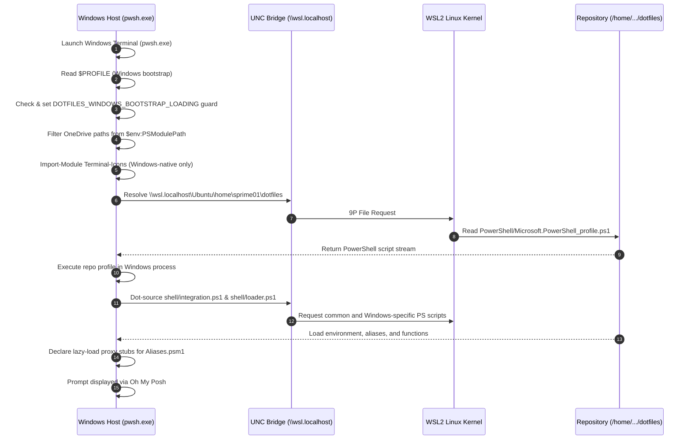
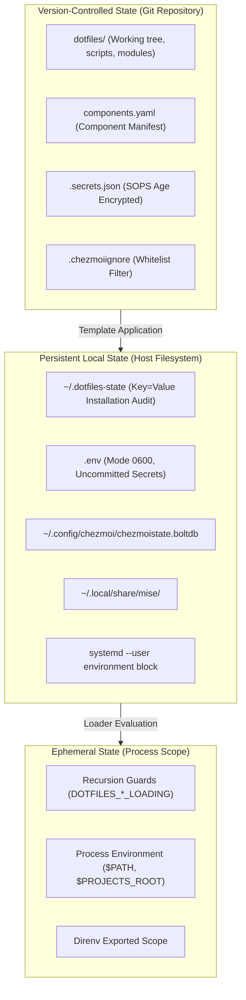

# Architecture Specification

> **Status:** Canonical Master Document  
> **Audience:** Engineers preparing to modify, extend, or audit the system  
> **Traceability:** Fully anchored to repository implementation evidence  

---

## 1. System Definition & Identity

This repository is a **cross-platform, multi-host developer environment orchestration system** that synchronizes shell configurations, tool versioning, environment variables, secrets, and AI agent contexts across Linux, WSL2, macOS, and Windows PowerShell 7. It enforces a DRY (Don't Repeat Yourself), layered architecture rooted in Git and managed via `chezmoi`, `just`, `direnv`, and `mise`.

### Core Architectural Invariant
> **The host boundary separates environment from configuration:**  
> Windows is the **terminal host and bootstrap anchor** (`pwsh.exe`); WSL2/Linux is the **POSIX execution and code authoring environment** (`zsh`/`bash`). All developer configuration lives canonically in the Git repository inside WSL2/Linux (`/home/sprime01/dotfiles`) and is bridged into Windows via Universal Naming Convention (UNC) network paths, completely avoiding cross-filesystem symlink corruption and privilege elevation requirements.

---

## 2. Logical Architecture

The system is decomposed into seven decoupled logical subsystems, each with discrete state ownership and explicit interfaces:



### Notice About This Diagram
- **What to notice:** The Windows bootstrap profile does not contain actual configuration; it merely acts as a bridge reaching over UNC into the repository.
- **Why the relationship matters:** Updating the Git repository in WSL immediately updates PowerShell 7 in Windows without needing a synchronization step.
- **What is omitted:** Internal function-level call paths and individual third-party tools (e.g. `fzf`, `p10k`).

---

## 3. Runtime & Host Topology

The physical execution topology spans two separate operating system boundaries communicating via hypervisor interconnects:

| Component | Operating Environment | Process Identity | Filesystem Location |
| :--- | :--- | :--- | :--- |
| **Terminal Host** | Windows 11 / Host OS | `WindowsTerminal.exe` / `pwsh.exe` | `C:\Users\<user>\` |
| **Windows Profile** | Windows PowerShell 7 | `pwsh.exe` | `C:\Users\<user>\OneDrive\Documents\PowerShell\Microsoft.PowerShell_profile.ps1` |
| **WSL Host Profile** | WSL2 (Ubuntu 24.04/26.04) | `pwsh` | `/home/sprime01/dotfiles/PowerShell/Microsoft.PowerShell_profile.ps1` |
| **POSIX Shell** | WSL2 (Ubuntu) | `zsh` / `bash` | `/home/sprime01/.zshrc`, `/home/sprime01/.bashrc` |
| **Repository Root** | WSL2 Linux Ext4 | Git Working Tree | `/home/sprime01/dotfiles/` |
| **UNC Bridge** | 9P / Plan9 / P9FS Mount | Hypervisor IPC | `\\wsl.localhost\Ubuntu\home\sprime01\dotfiles\` |
| **GUI App Env** | Linux User Session | `systemd --user` | `/run/user/1000/systemd/user/` |



---

## 4. Dependency Architecture

The repository enforces strict one-way dependency boundaries to prevent cyclic references and undefined startup states:

```mermaid
graph RL
    subgraph Tier0 ["Tier 0: System Primaries"]
        OS["Operating System (Linux Kernel / Windows NT)"]
        CoreTools["Core Binaries (git, curl, awk, sed)"]
    end

    subgraph Tier1 ["Tier 1: Core Shared Libraries"]
        PlatformLib["lib/platform-detection.sh"]
        StateLib["lib/state-management.sh"]
        ErrorLib["lib/error-handling.sh"]
        ConstantsLib["lib/constants.sh"]
    end

    subgraph Tier2 ["Tier 2: Environment & Security Core"]
        EnvLoader["lib/env-loader.sh"]
        SecureInstall["lib/secure-install.sh"]
        EnvCtl["scripts/envctl.sh"]
        SopsAge[".sops.yaml & .secrets.json"]
    end

    subgraph Tier3 ["Tier 3: Modular Loaders & Templates"]
        ShellInit[".shell_init.sh"]
        ShellLoader["shell/loader.sh / loader.ps1"]
        ChezmoiTemplates["dot_bashrc.tmpl / dot_zshrc.tmpl"]
    end

    subgraph Tier4 ["Tier 4: Tool Integrations & Shell Configurations"]
        CommonShell["shell/common/*"]
        PlatformShell["shell/platform-specific/*"]
        AliasesPSM["PowerShell/Modules/Aliases/Aliases.psm1"]
        MiseDirenv["mise / direnv"]
    end

    subgraph Tier5 ["Tier 5: Task Facades & Verification"]
        Justfile["justfile"]
        DoctorScript["scripts/doctor.sh"]
        TestHarness["test/run-all-tests.sh"]
        MCP["mcp/servers.json"]
    end

    Tier1 --> Tier0
    Tier2 --> Tier1
    Tier3 --> Tier2
    Tier4 --> Tier3
    Tier5 --> Tier4
    Tier5 --> Tier2
```



### Dependency Rules:
1. **Tier 1 (Libraries) must never depend on Tier 3 or 4:** `lib/platform-detection.sh` and `lib/state-management.sh` must be pure POSIX shell functions capable of running before any dotfiles environment is loaded.
2. **Windows bootstrap must never load WSL modules:** Windows PowerShell must never import modules from Linux `/home` or WSL paths that invoke `Import-Clixml` or native Linux binary objects.
3. **Lazy-Load Isolation:** `Aliases.psm1` is located in Tier 4 and is strictly isolated from Tier 3 startup; it is loaded only upon first interactive invocation of its proxy commands.

---

## 5. Data Architecture & State Ownership

State in this system is deliberately compartmentalized based on mutability, security, and persistence:



### State Storage & Permissions Matrix

| State Item | Location | Format | Mutability | Permissions | Verification Mechanism |
| :--- | :--- | :--- | :--- | :--- | :--- |
| **Component Manifest** | `components.yaml` | YAML | Maintained in Git | `0644` | Parsed by setup wizards & CI |
| **Setup State File** | `~/.dotfiles-state` | KEY=VALUE | Modified by `lib/state-management.sh` | `0600` | Read by `bootstrap.sh` |
| **Local Env Variables** | `.env` | KEY=VALUE | Managed via `scripts/envctl.sh` | `0600` strictly | Checked by `scripts/permission-audit.sh` |
| **Encrypted Secrets** | `.secrets.json` | JSON (SOPS) | Edited via `just secrets-edit` | `0644` (Git) | Decrypted with Age private key |
| **User Profile (Windows)**| `$PROFILE` | PowerShell | Overwritten by `scripts/setup-pwsh7.sh` | Windows ACL | Smoke-tested via `pwsh -NoProfile` |
| **Global Git Ignore** | `~/.gitignore_global` | Gitignore | Managed via `dot_gitignore_global` | `0644` | Verified by `test/test-gitignore-global.sh` |

---

## 6. Control Flow & Execution Lifecycle

Execution follows distinct lifecycle phases depending on the entry trigger:

```mermaid
stateDiagram-v2
    [*] --> Detection: Shell Session Started (Login / Interactive)
    Detection --> PlatformCheck: Source .shell_init.sh or loader.ps1
    
    state PlatformCheck {
        [*] --> DetectOS: uname -s / $IsWindows
        DetectOS --> DetectWSL: Check /proc/version or WSL_DISTRO_NAME
        DetectWSL --> ExportPlatform: Export DOTFILES_PLATFORM & DOTFILES_SHELL
    }

    PlatformCheck --> LoadEnvironment: Platform Identified
    
    state LoadEnvironment {
        [*] --> ResolveRoot: Calculate DOTFILES_ROOT
        ResolveRoot --> SourceSecureEnv: lib/env-loader.sh (dedup PATH)
        SourceSecureEnv --> ParseDotEnv: Load .env (0600 check)
        ParseDotEnv --> HookTools: Init direnv / mise hooks
    }

    LoadEnvironment --> LoadAliasesAndFuncs: Core Environment Ready
    
    state LoadAliasesAndFuncs {
        [*] --> LoadCommon: Source common/aliases & functions
        LoadCommon --> LoadPlatformSpecific: Source platform-specific scripts
        LoadPlatformSpecific --> RegisterLazyProxies: Create proxy stubs (Aliases.psm1)
    }

    LoadAliasesAndFuncs --> VisualPresentation: Prompt Configuration
    VisualPresentation --> InteractiveReady: Powerlevel10k / Oh My Posh Ready
    InteractiveReady --> [*]
```



---

## 7. Trust & Security Boundaries

The system operates across three distinct security boundaries:

```mermaid
graph LR
    subgraph PublicBoundary ["Public / Untrusted Zone"]
        GitRemote["GitHub Public/Private Remote"]
        WebInstaller["Oh My Posh / Remote Scripts"]
    end

    subgraph UserHostBoundary ["Protected User Host (0644 / Git Tracked)"]
        RepoDir["/home/sprime01/dotfiles/"]
        EncryptedSecrets[".secrets.json (Encrypted via Age)"]
        SopsConfig[".sops.yaml"]
        ChezmoiCfg["dot_*.tmpl Files"]
    end

    subgraph PrivateSecureBoundary ["Private / High Security Zone (0600 Strict)"]
        AgeKey["~/.config/sops/key.txt (Private Key)"]
        LocalEnv[".env (Decrypted Secrets & API Keys)"]
        StateRecord["~/.dotfiles-state"]
        SystemdUser["systemd User Runtime Memory"]
    end

    WebInstaller -->|lib/secure-install.sh (HTTPS + SHA256)| RepoDir
    GitRemote -->|git pull| RepoDir
    EncryptedSecrets -->|Age Key + SOPS| LocalEnv
    LocalEnv -->|scripts/sync-env-to-systemd.sh| SystemdUser
    LocalEnv -->|scripts/envctl.sh| LocalEnv
```

### Security Invariants:
1. **Network Script Execution:** Any script fetched from the internet (e.g. Oh My Posh installer) must pass through `lib/secure-install.sh` enforcing TLS 1.2+ and verifying SHA256 checksums unless explicitly bypassed with `NO_NETWORK=1` or `skip` in `lib/constants.sh`.
2. **Deny-by-Default Home Whitelist:** `.chezmoiignore` starts with `*` (ignore all files) and only un-ignores an explicit minimal whitelist (`.bashrc`, `.zshrc`, `.justfile`, `.mise.toml`, `.gitignore_global`). This prevents credentials, git histories, or test scripts from accidentally leaking into `$HOME`.
3. **Environment File Permissions:** `.env` is created with `umask 077` and verified by `scripts/permission-audit.sh` and `scripts/envctl.sh` to enforce `0600`.
4. **No Cross-Host Path Execution from Windows into WSL:** Windows processes never execute native Linux ELF binaries directly; they only read PowerShell scripts over the UNC 9P share.

---

## 8. Subsystem Directory Map

For deep implementation specifications, refer to the dedicated subsystem guides:

- [Shell Initialization & Modular Loader Engine](subsystems/shell-loader.md)
- [Cross-Platform Host Bridge & PowerShell 7 Subsystem](subsystems/powershell-host-bridge.md)
- [Dotfile State & Templating Management](subsystems/dotfile-management.md)
- [Environment & Configuration Pipeline](subsystems/environment-pipeline.md)
- [Security, Secrets & Packaging](subsystems/secrets-security.md)
- [AI Tooling & Context Protocols (MCP)](subsystems/ai-mcp-integration.md)
- [Automation, Diagnostics & Verification](subsystems/automation-verification.md)

---

## 9. Source Trail

This architecture document is verified against the following concrete source artifacts:

| Claim / Mechanism | Source File | Key Symbols / Identifiers | Verification Evidence |
| :--- | :--- | :--- | :--- |
| **Component Manifest** | [components.yaml](../components.yaml) | `components`, `idempotent`, `depends_on` | [docs/adr/0001-adopt-component-manifest-and-script-headers.md](adr/0001-adopt-component-manifest-and-script-headers.md) |
| **POSIX Shell Loader** | [shell/loader.sh](../shell/loader.sh) | `safe_source`, `SHELL_CONFIG_ROOT`, `CURRENT_PLATFORM` | [test/test-environment-loading.sh](../test/test-environment-loading.sh) |
| **Fast Shell Init** | [.shell_init.sh](../.shell_init.sh) | `DOTFILES_ROOT`, `__load_wsl_integration` | [docs/work_summaries/SHELL_MIGRATION.md](work_summaries/SHELL_MIGRATION.md) |
| **Windows Profile Bridge** | [scripts/setup-pwsh7.sh](../scripts/setup-pwsh7.sh) | `DOTFILES_WINDOWS_BOOTSTRAP_LOADING`, `\\wsl.localhost\` | [test/test-powershell-aliases.ps1](../test/test-powershell-aliases.ps1) |
| **PowerShell Repo Profile** | [PowerShell/Microsoft.PowerShell_profile.ps1](../PowerShell/Microsoft.PowerShell_profile.ps1) | `DOTFILES_PWSH_PROFILE_LOADING`, `Aliases.psm1` proxies | [test/test-powershell-theme.ps1](../test/test-powershell-theme.ps1) |
| **Platform Detection** | [lib/platform-detection.sh](../lib/platform-detection.sh) | `detect_platform`, `is_wsl`, `is_linux`, `is_windows` | [test/test-environment.sh](../test/test-environment.sh) |
| **Secure Env Loader** | [lib/env-loader.sh](../lib/env-loader.sh) | `add_path_once`, `load_tool_modules` | [test/test-no-deprecated-loaders.sh](../test/test-no-deprecated-loaders.sh) |
| **State Management** | [lib/state-management.sh](../lib/state-management.sh) | `write_state_key`, `DOTFILES_STATE_FILE` | [test/test-bootstrap-idempotent.sh](../test/test-bootstrap-idempotent.sh) |
| **Secure Installer** | [lib/secure-install.sh](../lib/secure-install.sh) | `secure_install`, `sha256sum` | [test/test-oh-my-posh-checksum.sh](../test/test-oh-my-posh-checksum.sh) |
| **Chezmoi Whitelist** | [.chezmoiignore](../.chezmoiignore) | `*`, `!.bashrc`, `!.zshrc` | [test/test-chezmoi-templates.sh](../test/test-chezmoi-templates.sh) |
| **Secrets Engine** | [.sops.yaml](../.sops.yaml) | `creation_rules`, Age public key | [docs/how-to/SECRET_MANAGEMENT.md](how-to/SECRET_MANAGEMENT.md) |
| **Task Automation** | [justfile](../justfile) | `default`, `test`, `doctor`, `setup-pwsh7` | [test/test-global-justfile.sh](../test/test-global-justfile.sh) |
| **Health Diagnostics** | [scripts/doctor.sh](../scripts/doctor.sh) | `QUICK`, `VERBOSE`, `STRICT` | [test/test-doctor.sh](../test/test-doctor.sh), [test/test-doctor-flags.sh](../test/test-doctor-flags.sh) |
| **Testing Harness** | [test/framework.sh](../test/framework.sh) | `test_assert`, `test_assert_contains` | [test/run-all-tests.sh](../test/run-all-tests.sh) |
