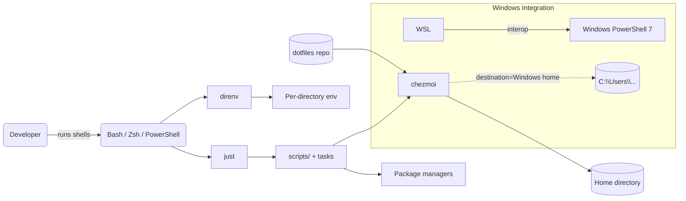

# Architecture and Rationale

Why this stack

- chezmoi: idempotent, template-aware management of dotfiles with first-class cross‑platform support.
- direnv: project‑scoped, opt‑in environments; quiet by default but debuggable.
- just: ergonomic, documented task runner for repeatable workflows.

How they fit together

- This repo is the source of truth. `install.sh` ensures chezmoi is present, initializes it with this repo, and applies templates.
- Shell profiles (zsh, bash, PowerShell) load modular configuration from `shell/` and apply direnv hooks where applicable.
- direnv reads `.envrc` in this repo to set quiet logging, `umask`, watch dotenv files, and optionally integrate with `mise`.
- just provides a discoverable facade for common flows (direnv install, Windows integration, etc.).

Mermaid container diagram (C4-style)

Key choices

- Deny‑by‑default `.chezmoiignore` to avoid accidental home pollution; explicitly whitelist `dot_*` and Windows paths.
- Keep Windows PowerShell profile management via helpers to minimize path and permissions surprises.
- Quiet direnv unless debugging; reduce cognitive noise for daily work.

Change impact

- Most flows are idempotent. Templates and loaders aim for composability and clarity over cleverness.

