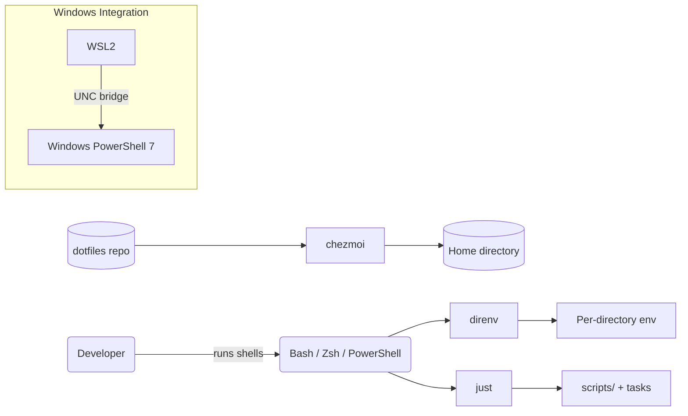

# Architecture and Rationale

> **Notice:** This document provides a brief conceptual summary. For the authoritative, canonical architectural master document with full logical, runtime, dependency, and security views, see **[Architecture Specification](../architecture.md)**.

## Why This Stack
- **chezmoi**: Idempotent, template-aware management of dotfiles with first-class cross-platform support.
- **direnv**: Project-scoped, opt-in environments; quiet by default but debuggable.
- **just**: Ergonomic, documented task runner for repeatable workflows.
- **mise**: Fast polyglot tool version manager activated early in shell init.

## High-Level System Map

```mermaid
flowchart LR
  user(Developer) -->|runs shells| shells(Bash / Zsh / PowerShell)
  repo[(dotfiles repo)] --> cm[chezmoi]
  cm --> home[(Home directory)]
  shells --> direnv
  shells --> just
  direnv --> env[Per-directory env]
  just --> scripts[scripts/ + tasks]

  subgraph Windows Integration
    WSL[WSL2] -->|UNC bridge| pwsh[Windows PowerShell 7]
  end
```

For the complete architectural model, see:
- **[Architecture Specification](../architecture.md)**
- **[System Mental Model](../mental-model.md)**
- **[Subsystem Guides](../subsystems/shell-loader.md)**
- **[Execution Workflows](../workflows/shell-startup.md)**
- **[Design Decisions & Trade-offs](design-decisions.md)**
