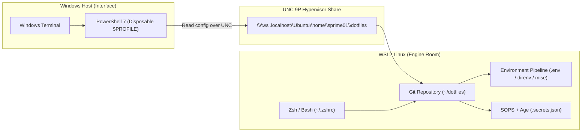

# Dotfiles System — Technical Knowledge System

> **Orientation:** Layer 0 Entry Point  
> **Audience:** Everyone — from newcomers with no prior repository context to senior engineers seeking architectural depth  
> **System Status:** Production Cockpit (WSL2, Linux, macOS, Windows PowerShell 7)  

---

## 1. What This Project Is

This repository is a **unified cross-platform developer environment**. It manages and synchronizes shell configurations (`zsh`, `bash`, and `pwsh`), environment variables, toolchains (`mise`, `direnv`), encrypted secrets (`sops`, `age`), AI agent protocols (Model Context Protocol), and terminal themes (`powerlevel10k`, `oh-my-posh`) across Linux, WSL2, and Windows hosts from a single Git repository.

---

## 2. What Problem It Solves

Modern developers often work in mixed environments: Windows as the physical host and terminal runner, with WSL2 or remote Linux as the development environment.

Without a unified system, this setup degrades rapidly:
- **Duplicated Configs:** Developers create separate aliases and scripts for Windows PowerShell and Linux Bash.
- **Startup Latency:** Heavy PowerShell and Zsh configurations easily blow past 1 to 2 seconds of startup lag.
- **Path & Symlink Corruption:** Windows NTFS symlinks pointing into Linux ext4 filesystems corrupt across reboots or require administrative elevation.
- **Secret Leaks:** Accidental commits of `.env` files or API keys into public repositories.
- **Toolchain Inconsistency:** Node, Python, or Go versions diverge between Windows IDE extensions and WSL terminals.

**This system solves these problems by establishing a strict host-boundary separation:** all configuration lives in the Linux filesystem in WSL2 and is bridged into Windows PowerShell via Universal Naming Convention (UNC) network paths. Common aliases and environment variables are written once and shared across all shells, while startup times are kept strictly under 250 milliseconds using lazy-loading proxy stubs.

---

## 3. The System in One Picture

---

## 4. The 7 Concepts You Need First

1. **`DOTFILES_ROOT`**: The absolute path to this repository, computed portably at startup (e.g. `/home/sprime01/dotfiles` in Linux, or `\\wsl.localhost\Ubuntu\...` in Windows).
2. **`PROJECTS_ROOT`**: The base folder where your development projects live (defaults to `$HOME/projects` or Windows `$env:USERPROFILE\projects`).
3. **Disposable Bootstrap (`$PROFILE`)**: The minimal 15-line stub in Windows user storage that reaches over UNC into WSL. It can be regenerated at any time with `just setup-pwsh7`.
4. **Repo Profile (`PowerShell/Microsoft.PowerShell_profile.ps1`)**: The full, version-controlled PowerShell profile stored in the repository.
5. **Lazy-Load Proxy Stubs**: Tiny wrapper functions in PowerShell that defer loading the heavy `Aliases.psm1` module until you actually call a command (e.g. `gs`), keeping startup under 200ms.
6. **Deny-by-Default Whitelist (`.chezmoiignore`)**: Chezmoi ignores all files (`*`) except an explicit minimal whitelist (`.bashrc`, `.zshrc`, `.justfile`, `.mise.toml`, `.gitignore_global`), preventing repository scratch files from polluting your home directory.
7. **Safe Environment Controller (`scripts/envctl.sh`)**: Manages `.env` variables with strict `0600` permissions without using dangerous `eval` statements.

---

## 5. A Representative Journey: Opening a Terminal & Running a Command

Here is what happens when you launch Windows Terminal and type `gs`:

1. **Host Launch:** Windows Terminal starts `pwsh.exe` in Windows.
2. **Bootstrap Stub:** PowerShell reads `$PROFILE` in your Windows user folder, purges slow OneDrive paths, imports `Terminal-Icons`, and accesses `\\wsl.localhost\Ubuntu\home\sprime01\dotfiles`.
3. **Repo Sourcing:** The repository profile in WSL is dot-sourced into the Windows process. It parses `.env`, sets up Oh My Posh, and declares lazy-loading proxy stubs. The prompt appears in ~190ms.
4. **Command Execution:** You type `gs`. PowerShell runs the proxy stub, which executes `Import-Module Aliases.psm1 -Force` and calls `Get-GitStatus`. The git status of your active repository is displayed immediately.

---

## 6. Where to Go Next: Navigation by Intent

### 🚀 "I want to set up a new machine"
- Follow the step-by-step [New Machine Setup Tutorial](tutorials/new-machine-setup.md).
- If connecting Windows PowerShell 7 to WSL2, follow the [Windows-WSL Integration Tutorial](tutorials/windows-wsl-integration.md).

### 🏗️ "I want to understand the architecture"
- Read the [System Mental Model](mental-model.md) for conceptual structure and boundaries.
- Read the comprehensive [Architecture Specification](architecture.md) for logical, runtime, dependency, and security views.
- Explore individual [Subsystem Guides](subsystems/shell-loader.md).

### 🛠️ "I want to perform a specific task"
- [How to add an alias or function across shells](how-to/add-alias-or-function.md)
- [How to manage encrypted secrets with SOPS](how-to/manage-secrets-sops.md)
- [How to configure and test an MCP gateway](how-to/configure-mcp.md)
- [How to use chezmoi across Windows and WSL](how-to/chezmoi-windows.md)

### 🐛 "I am diagnosing or troubleshooting an issue"
- Follow the [Diagnose and Repair Guide](how-to/diagnose-and-repair.md).
- Consult the [Comprehensive Troubleshooting Matrix](how-to/troubleshooting.md).
- Trace the execution path in [Shell Startup Workflow](workflows/shell-startup.md) or [PowerShell UNC Startup Workflow](workflows/powershell-unc-startup.md).

### 📖 "I need exact command or variable references"
- Look up tasks in [CLI Commands Reference](reference/cli-commands.md).
- Look up variables in [Environment Variables Dictionary](reference/env-vars.md).
- Check the [Documentation Map](documentation-map.md) for the complete page catalog.
- Check the [Source Map](source-map.md) to trace concepts back to implementation code.
