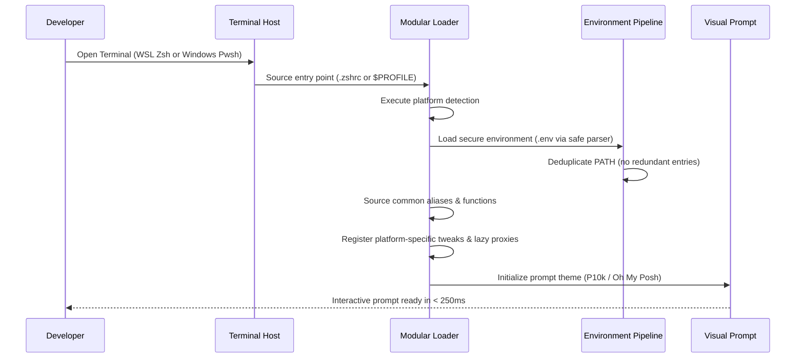

# System Mental Model

> **Layer:** 1 (Conceptual Understanding)  
> **Audience:** Newcomers and engineers seeking the foundational mental model before diving into code  
> **Purpose:** Build an intuitive, precise mental model of how the system functions without drowning in source lines  

---

## 1. The Core Metaphor: The Developer Cockpit

Think of this system as an **airplane cockpit with two control consoles**:
- **Console 1 (Windows Host):** The physical glass cockpit (Windows Terminal, GPU acceleration, hardware peripherals, display scaling, Windows credential store).
- **Console 2 (Linux Engine Room):** The jet engine (Ubuntu WSL2, POSIX toolchains, GCC, Python, Rust, Docker daemon, Git trees).

In a naive setup, developers try to duplicate their configurations across both consoles: they install Git for Windows, install tools in PowerShell, duplicate aliases in `.bashrc`, and constantly battle broken line endings (`CRLF` vs `LF`) or file permissions.

This repository **unifies the controls while separating the physical hardware**:
1. All configuration lives in one single place: the Linux filesystem inside WSL2 (`/home/sprime01/dotfiles`).
2. Windows PowerShell 7 acts as an interface satellite: when launched, it reaches through a high-speed inter-process network pipe (the UNC 9P bridge `\\wsl.localhost\Ubuntu\...`) and sources the exact same configurations, aliases, and functions that Linux uses.
3. Secrets, environment variables, and tool versions are managed through single-point declarations that feed both environments automatically.

```
                    ┌────────────────────────────────────────────────────────┐
                    │                      Windows Host                      │
                    │   Windows Terminal, Font Rendering, Display Scaling    │
                    └───────────────────────────┬────────────────────────────┘
                                                │
                                                ▼
                     PowerShell 7 Window ($PROFILE Disposable Bootstrap)
                                                │
                       Reads configuration over UNC network share
                                                │
                    ┌───────────────────────────▼────────────────────────────┐
                    │                   WSL2 Linux Subsystem                 │
                    │                                                        │
                    │   Canonical Dotfiles Repository (~/dotfiles)           │
                    │   ├── Core modular scripts (shell/loader.sh, .ps1)    │
                    │   ├── Task execution (justfile)                        │
                    │   ├── Secret management (.secrets.json, Age)           │
                    │   └── Environment pipeline (direnv, mise)              │
                    └────────────────────────────────────────────────────────┘
```

---

## 2. Responsibilities and Boundaries

To understand the system, you must know what it owns and what it deliberately leaves to upstream tools:

### What the System Owns
- **Shell Initialization Sequencing:** Deterministic ordering of environment variables, paths, aliases, completions, and prompts.
- **Cross-Platform Parity:** Guaranteeing that common developer commands (`projects`, `cddot`, `gs`, `ff`, `ports`) work identically in PowerShell, Bash, and Zsh.
- **Host Separation Hygiene:** Ensuring Windows-only modules (like `Terminal-Icons`) never contaminate WSL2, and Linux ELF binaries are never called directly by Windows.
- **Secret Encryption & Decryption:** Providing frictionless on-demand decryption of `.env` files via Age and SOPS without storing decrypted plaintext in version control.
- **Non-destructive Idempotency:** Allowing any setup or bootstrap script to be run multiple times safely without corrupting existing user configurations.

### What the System Deliberately Does NOT Own
- **Package Installation:** The dotfiles configure tools, but do not replace package managers (`apt`, `winget`, `nix`, `brew`).
- **Binary Distribution:** Tools like `chezmoi`, `direnv`, and `mise` are fetched from upstream releases or installed via package managers.
- **Project-Specific Dependencies:** Individual project tool versions belong in project repositories; this repo provides the `direnv` and `mise` runtime hooks to activate them automatically.

---

## 3. Major Abstractions

The repository organizes its behavior around five foundational abstractions:

### 1. `DOTFILES_ROOT` (The Geographic Center)
Every script, loader, and test derives its paths relative to `DOTFILES_ROOT`.
- On Linux/WSL: `/home/sprime01/dotfiles` (or wherever cloned).
- On Windows: `\\wsl.localhost\Ubuntu\home\sprime01\dotfiles`.
By never assuming absolute hardcoded paths (like `C:\` or `/home`), the entire repository can be cloned anywhere or run under different usernames without breaking.

### 2. Disposable Bootstrap Profile vs Repo Profile
- **Disposable Bootstrap (`$PROFILE` on Windows):** A tiny 15-line stub written to Windows user storage by `scripts/setup-pwsh7.sh`. It contains no logic except resolving `DOTFILES_ROOT` and dot-sourcing the real profile. If deleted, it can be regenerated with `just setup-pwsh7`.
- **Repo Profile (`PowerShell/Microsoft.PowerShell_profile.ps1`):** The comprehensive developer profile tracked in Git.

### 3. Lazy-Load Proxies
In PowerShell, loading heavy modules with dozens of functions can cause startup delays (1 to 2 seconds). The repo profile uses **proxy function stubs**:
```powershell
function gs { Import-Module $aliasesModulePath -Force; Get-GitStatus @args }
```
When you launch PowerShell, startup takes only ~200ms because `Aliases.psm1` is not imported. The very first time you type `gs`, PowerShell imports the module and replaces the proxy with the real cmdlet.

### 4. Deny-by-Default Whitelist
Chezmoi is configured with `.chezmoiignore` starting with `*` (ignore everything). Instead of having to remember to ignore every new script or test, developers must explicitly whitelist the few files intended to be linked into the user's home directory (`.bashrc`, `.zshrc`, `.justfile`, `.mise.toml`, `.gitignore_global`).

### 5. Safe Environment Pipeline (`envctl` + `env-loader`)
Environment variables are defined in `.env` with strict `0600` permissions. They are never parsed with `eval`. Instead, `lib/env-loader.sh` reads keys and values safely, de-duplicates `$PATH` entries, and propagates them to shells, `direnv`, and `systemd --user` for GUI applications.

---

## 4. Runtime Lifecycle: What Happens When You Open a Shell



---

## 5. State Ownership & Persistence

Where does data live, and who is allowed to change it?

1. **Git Repository (Source of Truth):**
   - Holds code, modular loaders, `components.yaml`, `.sops.yaml`, and encrypted `.secrets.json`.
   - Modifiable only via Git commits.
2. **Local User Environment (`.env`):**
   - Holds uncommitted local keys and overrides (e.g. `GEMINI_API_KEY`).
   - Owned by the user, managed via `scripts/envctl.sh`, enforced `0600` permissions.
3. **Installation State Record (`~/.dotfiles-state`):**
   - Records key-value pairs tracking completed bootstrap stages (e.g. `setup_completed=2026-09-03T18:00:00Z`).
   - Managed atomically by `lib/state-management.sh`.
4. **Tool Activation Cache (`~/.local/share/mise`, `~/.cache`):**
   - Owned by individual tools (`mise`, `p10k instant prompt`).

---

## 6. What Can Go Wrong: Mental Model for Failure

When something breaks, it almost always falls into one of three boundaries:

1. **The UNC Network Boundary:** Windows cannot find `\\wsl.localhost\Ubuntu`.  
   *Reason:* WSL is stopped or the distribution name is not `Ubuntu`.  
   *Fix:* Run `wsl --status` and check `scripts/setup-pwsh7.sh`.
2. **The Module Separation Boundary:** XML or parser crash during PowerShell startup.  
   *Reason:* A Windows-only module (like `Terminal-Icons`) was loaded inside WSL `pwsh`.  
   *Fix:* Verify host isolation guards (`$IsWindows -and PSEdition -eq 'Core'`).
3. **The Permission Boundary:** `.env` file rejected or warnings printed during startup.  
   *Reason:* File permissions on `.env` were loosened from `0600`.  
   *Fix:* Run `just env-fix-perms` or `scripts/envctl.sh`.

---

## 7. Next Steps in the Documentation System

Now that you have the conceptual mental model:
- To understand the exact wiring and process boundaries, read [Architecture Specification](architecture.md).
- To examine a specific subsystem, read [Subsystem Guides](subsystems/shell-loader.md).
- To follow an end-to-end execution trace, see [Workflows](workflows/shell-startup.md).
- To perform a specific task, consult [How-To Guides](how-to/add-alias-or-function.md).
