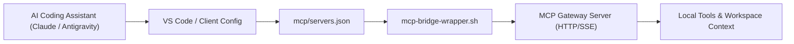

# Subsystem Guide: AI Tooling & Context Protocols (MCP)

> **Layer:** 3 (Subsystem Decomposition)  
> **Subsystem:** Model Context Protocol Gateway & IDE Assistant Integration  
> **Primary Source Artifacts:** `mcp/servers.json`, `mcp/mcp-helper.sh`, `mcp/mcp-helper.ps1`, `mcp/mcp-bridge-wrapper.sh`, `mcp/migrate-vscode-settings.sh`  

---

## 1. Purpose
The AI Tooling & MCP Integration subsystem standardizes how large language model agents (Claude, Gemini, Cursor, Copilot) interface with the developer workspace. It bridges shell session context (current directory, running processes, git metadata, and environment) into local and remote Model Context Protocol (MCP) gateways.

---

## 2. Responsibilities
- Defining standard MCP gateway connections in `mcp/servers.json`.
- Providing cross-platform helper utilities (`mcp-helper.sh` and `mcp-helper.ps1`) to inspect, validate, and inject MCP configuration into editors.
- Automating VS Code and Claude configuration merging (`migrate-vscode-settings.sh`).
- Isolating MCP server credentials into `mcp/.env` with guarded verification in `bootstrap.sh`.

---

## 3. Non-Responsibilities
- **Hosting Remote MCP Servers:** Does not host cloud gateways; configures client endpoints.
- **Model Inference:** Inference is performed by upstream model providers.

---

## 4. Position in the System
- **Called by:**
  - `bootstrap.sh` / `bootstrap.ps1` (environment audit)
  - VS Code extensions, Claude Code, Cline, Roo Code, Antigravity IDE
  - `mcp-helper.sh` / `mcp-helper.ps1`
- **Calls:**
  - Node.js runtime (`mcp_stdio_bridge.js`)
  - VS Code configuration directory (`~/.vscode-server/data/Machine/settings.json` or Windows `%APPDATA%\Code\User\settings.json`)

---

## 5. Core Abstractions

### 1. `mcp/servers.json`
The central manifest specifying available MCP tools:
```json
{
  "mcpServers": {
    "mcp-gateway": {
      "command": "node",
      "args": ["$MCP_BRIDGE_SCRIPT_PATH"],
      "env": {
        "MCP_GATEWAY_URL": "$MCP_GATEWAY_URL",
        "MCP_ADMIN_USERNAME": "$MCP_ADMIN_USERNAME",
        "MCP_ADMIN_PASSWORD": "$MCP_ADMIN_PASSWORD"
      }
    }
  }
}
```

### 2. Environment Parameterization
Sensitive variables (`MCP_GATEWAY_URL`, credentials) are never hardcoded in `servers.json`; they are loaded dynamically from `mcp/.env` or the host `.env` file via `Load-Env.ps1` or `lib/env-loader.sh`.

---

## 6. Internal Operation



---

## 7. Failure Modes & Diagnostics

| Symptom | Probable Cause | Diagnostic Evidence | Recovery Path |
| :--- | :--- | :--- | :--- |
| `MCP server failed to connect` | `mcp/.env` missing or gateway URL unreachable | Run `mcp/mcp-helper.sh env` | Copy `mcp/.env.template` to `mcp/.env` and supply valid URL |
| VS Code settings overwritten | Unmerged direct write | VS Code reports invalid JSON | Use `mcp/migrate-vscode-settings.sh` to safely merge settings |
| Node bridge not executable | Missing Node.js binary | `which node` fails | Ensure Node is installed via `mise` or system package manager |

---

## 8. Source Trail
- `mcp/servers.json` — MCP server declaration manifest
- `mcp/mcp-helper.sh` — Bash CLI helper for MCP operations
- `mcp/mcp-helper.ps1` — PowerShell CLI helper for MCP operations
- `mcp/mcp-bridge-wrapper.sh` — Stdio bridge runner
- `mcp/migrate-vscode-settings.sh` — Settings merge engine
- `test/test-mcp-idempotent.sh` — Test suite for MCP configuration idempotency
