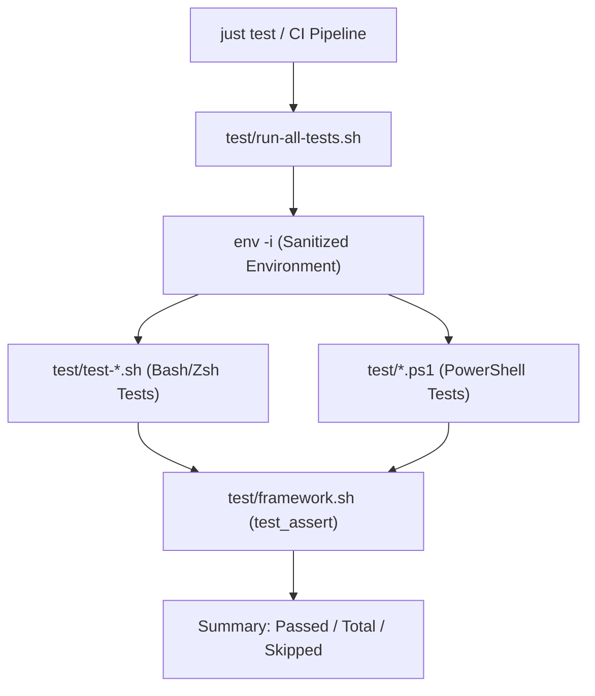

# Subsystem Guide: Automation, Diagnostics & Verification

> **Layer:** 3 (Subsystem Decomposition)  
> **Subsystem:** Task Orchestration, Diagnostic Doctor & Testing Harness  
> **Primary Source Artifacts:** `justfile`, `scripts/doctor.sh`, `test/framework.sh`, `test/run-all-tests.sh`, `tools/lint.sh`, `tools/measure-startup.sh`  

---

## 1. Purpose
This subsystem provides the developer command surface and quality gate for the entire repository. It ensures that setup operations are discoverable, repeatable, and verifiable across environments, catching regressions before code is committed.

---

## 2. Responsibilities
- Exposing 50+ self-documenting task recipes via `justfile`.
- Diagnosing host health, path integrity, and permission hygiene with `scripts/doctor.sh`.
- Executing isolated test suites across POSIX shells and PowerShell 7 using `test/run-all-tests.sh` and `test/framework.sh`.
- Enforcing static quality and format compliance (`tools/lint.sh` with `shellcheck` and `shfmt`).
- Benchmarking shell startup latency (`tools/measure-startup.sh`).

---

## 3. Position in the System
- **Called by:**
  - Developers via CLI (`just test`, `just doctor`, `just lint`)
  - CI/CD pipelines (GitHub Actions in `.github/workflows/`)
  - Pre-commit / Post-commit git hooks (`scripts/git-hooks/`)
- **Calls:**
  - All repository scripts, test suites, linters, and chezmoi

---

## 4. Core Abstractions

### 1. The Task Facade (`justfile`)
Acts as the single human-friendly command entry point:
```just
default:
    @just --list

test:
    @bash scripts/run-tests.sh

doctor:
    @bash scripts/doctor.sh

lint:
    @bash tools/lint.sh
```

### 2. The Diagnostic Doctor (`scripts/doctor.sh`)
Supports three execution modes:
- Default: Checks basic paths, required binaries, git ignores, and permissions.
- `--verbose`: Prints detailed diagnostic output including computed environment variables.
- `--strict`: Fails with non-zero exit code if any warning or insecure permission is encountered.

### 3. The Isolated Test Harness (`test/framework.sh` & `run-all-tests.sh`)
Provides assertion primitives (`test_assert`, `test_assert_contains`) and runs tests in clean subshells (`env -i`) to prevent host-specific variable leakage from producing false positives or false negatives.

---

## 5. Verification Pipeline



---

## 6. Failure Modes & Diagnostics

| Symptom | Probable Cause | Diagnostic Evidence | Recovery Path |
| :--- | :--- | :--- | :--- |
| `just: command not found` | `just` task runner not installed | `which just` fails | Install via `cargo install just`, `mise use just`, or `sudo apt install just` |
| Test fails with environment leak | Test script relies on uninitialized variable | `bash test/test-environment.sh` fails | Use `env -i` and explicit variable defaults |
| `tools/lint.sh` formatting error | Scripts do not conform to `shfmt` | `shfmt -d` outputs diff | Run `just format` or `shfmt -w .` |

---

## 7. Source Trail
- `justfile` — Primary developer task automation definitions
- `scripts/doctor.sh` — Environment and permission diagnostic script
- `test/framework.sh` — Core shell assertion library
- `test/run-all-tests.sh` — Universal test discovery and execution runner
- `tools/lint.sh` — Shellcheck and shfmt static verification
- `tools/measure-startup.sh` — Interactive shell startup benchmark
- `test/test-doctor.sh` — Test suite for doctor functionality
- `test/test-doctor-flags.sh` — Test suite for `--quick`, `--verbose`, `--strict` flags
