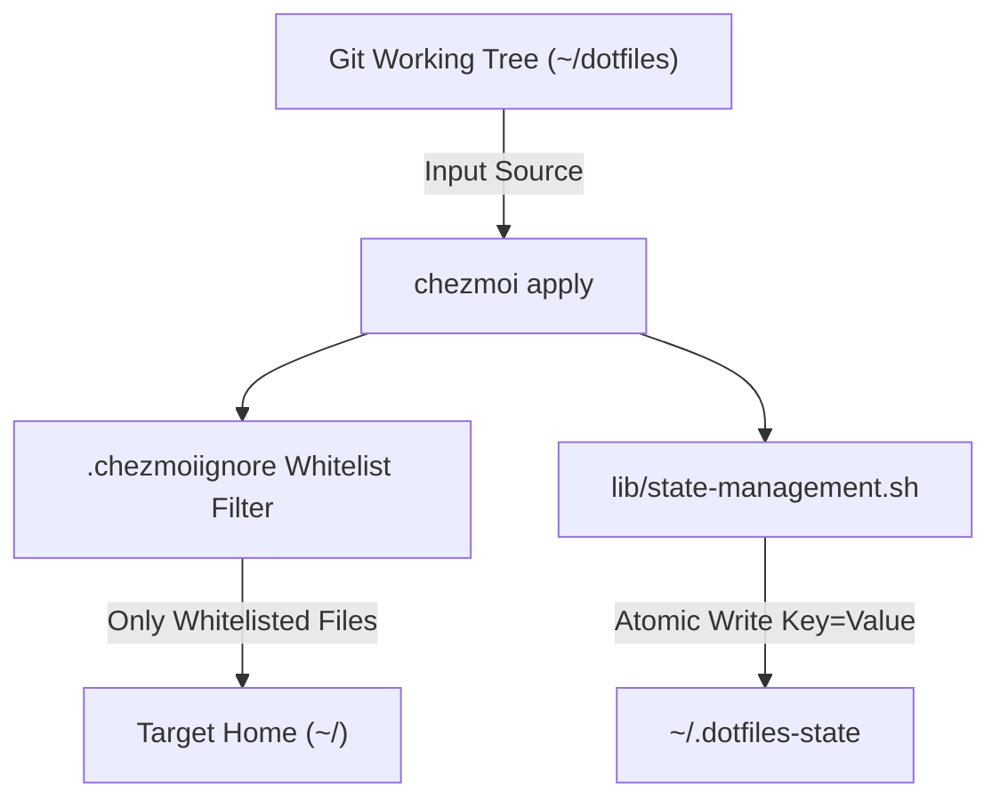

# Subsystem Guide: Dotfile State & Templating Management

> **Layer:** 3 (Subsystem Decomposition)  
> **Subsystem:** Declarative Dotfile Management & Idempotent State Engine  
> **Primary Source Artifacts:** `.chezmoiignore`, `dot_bashrc.tmpl`, `dot_zshrc.tmpl`, `dot_mise.toml`, `dot_justfile`, `lib/state-management.sh`, `components.yaml`  

---

## 1. Purpose
This subsystem handles the declarative, template-aware deployment of dotfiles to user home directories across Linux, macOS, and Windows. It solves configuration drift and home directory clutter by combining `chezmoi` declarative templating with an explicit **deny-by-default whitelist** and atomic state-tracking in `~/.dotfiles-state`.

---

## 2. Responsibilities
- Rendering platform-aware dotfiles (`~/.bashrc`, `~/.zshrc`, `~/.justfile`, `~/.mise.toml`, `~/.gitignore_global`) from Chezmoi templates.
- Enforcing a strict deny-by-default filter (`.chezmoiignore`) so that unwhitelisted files never leak into `$HOME`.
- Tracking installation and bootstrap milestones idempotently via `lib/state-management.sh` (`write_state_key`, `read_state_key`).
- Maintaining machine-readable component descriptions in `components.yaml` for automation and agent orchestration.

---

## 3. Non-Responsibilities
- **Direct Windows Profile Management:** Chezmoi does not directly overwrite Windows `$PROFILE` in `Documents\PowerShell` due to OneDrive path variations and permission traps; this is handled via `scripts/setup-pwsh7.sh`.
- **Runtime Environment Loading:** Shell sourcing is handled by the Shell Loader and Environment Pipeline.

---

## 4. Position in the System
- **Called by:**
  - `install.sh` (initial bootstrap)
  - `just update` / `chezmoi apply`
  - Automated tests (`test/test-chezmoi-templates.sh`, `test/test-bootstrap-idempotent.sh`)
- **Calls:**
  - `chezmoi` (binary CLI)
  - `lib/state-management.sh`

---

## 5. Core Abstractions

### 1. Deny-by-Default Whitelist (`.chezmoiignore`)
Unlike standard setups that blacklist individual sensitive files, this repository ignores everything (`*`) and explicitly whitelists only files intended for the target filesystem:
```
*
!.chezmoiignore
!.bashrc
!.gitignore_global
!.justfile
!.mise.toml
!.probe_file
!.state_probe
!.zshrc
```
This guarantees that newly created scripts, temporary logs, or secret files will never be copied to `$HOME` by a rogue `chezmoi apply`.

### 2. State Management API (`lib/state-management.sh`)
Provides portable, atomic key-value updates to `~/.dotfiles-state` using `awk` and temporary file swaps:
- `write_state_key "key" "value"`: Atomically writes or replaces `KEY=VALUE` without race conditions.
- `read_state_key "key"`: Reads value; returns 1 if key missing.
- `has_state_key "key"`: Predicate check.

### 3. Component Manifest (`components.yaml`)
Formalized by ADR 0001, defining system components, dependencies, scripts, idempotency guarantees, and test suites:
```yaml
components:
  - id: bash_config
    description: Bootstrap Bash/Zsh shared symlinks and environment
    script: bootstrap.sh
    depends_on: []
    idempotent: true
    tests: []
  - id: pwsh7_windows
    description: Windows PowerShell 7 profile integration from WSL
    script: scripts/setup-pwsh7.sh
    depends_on: [pwsh_config]
    idempotent: true
```

---

## 6. Internal Operation



---

## 7. State
- **State Read:** Chezmoi source directory, Git commit status, `components.yaml`.
- **State Modified:**
  - `$HOME/.bashrc`, `$HOME/.zshrc`, `$HOME/.justfile`, `$HOME/.mise.toml`.
  - `$HOME/.dotfiles-state` (permissions `0600`).
  - Chezmoi bolt database at `~/.config/chezmoi/chezmoistate.boltdb`.

---

## 8. Failure Modes & Diagnostics

| Symptom | Probable Cause | Diagnostic Evidence | Recovery Path |
| :--- | :--- | :--- | :--- |
| File not updating in `~` | File omitted from `.chezmoiignore` | `chezmoi diff` shows no output | Add `!<filename>` to `.chezmoiignore` |
| Template syntax error | Unterminated Go template bracket | `chezmoi apply` throws parse error | Test template with `chezmoi execute-template < file.tmpl` |
| Incomplete bootstrap state | Setup interrupted mid-run | `read_state_key setup_completed` empty | Re-run `bash bootstrap.sh` (safe and idempotent) |

---

## 9. Extension Points
- **Adding a Managed Dotfile:**
  1. Rename file with `dot_` prefix (e.g. `dot_gitconfig`).
  2. Add `!.gitconfig` to `.chezmoiignore`.
  3. Run `chezmoi diff` and `chezmoi apply`.

---

## 10. Source Trail
- `.chezmoiignore` — Deny-by-default whitelist rule definition
- `dot_bashrc.tmpl` / `dot_zshrc.tmpl` — Shell profile templates
- `dot_mise.toml` — Tool versioning template
- `dot_justfile` — Task runner alias template
- `lib/state-management.sh` — In-place state record modifier
- `components.yaml` — Machine-readable component declaration
- `test/test-chezmoi-templates.sh` — Template integrity test suite
- `test/test-bootstrap-idempotent.sh` — Idempotency verification test
