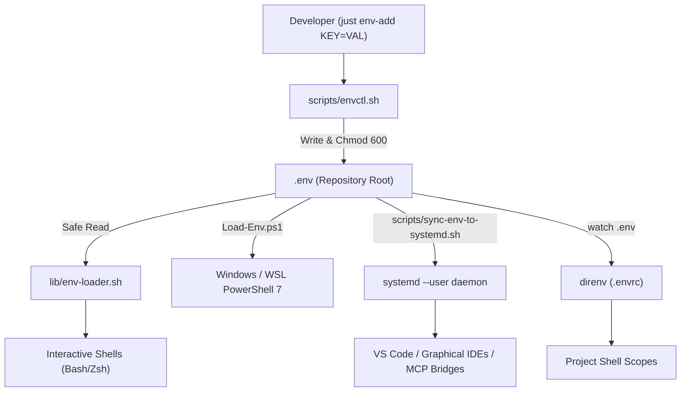

# Subsystem Guide: Environment & Configuration Pipeline

> **Layer:** 3 (Subsystem Decomposition)  
> **Subsystem:** Environment Variable Lifecycle, Tooling Activation & GUI Synchronization  
> **Primary Source Artifacts:** `scripts/envctl.sh`, `lib/env-loader.sh`, `.envrc`, `dot_mise.toml`, `scripts/sync-env-to-systemd.sh`, `scripts/export-to-systemd-env.sh`  

---

## 1. Purpose
The Environment & Configuration Pipeline provides safe, unified, and permission-hardened environment variable management across CLI processes, background daemons, and graphical desktop applications (like VS Code). It ensures that API keys and paths are loaded consistently without unsafe `eval` execution or leaky file permissions.

---

## 2. Responsibilities
- Managing `.env` variables via `scripts/envctl.sh` while enforcing strict `0600` file permissions.
- Providing safe POSIX environment parsing via `lib/env-loader.sh` (`load_env_file_secure`).
- Deduplicating and cleanly prepending entries to `$PATH` using `add_path_once`.
- Project-scoped environment switching via `direnv` (`.envrc`).
- Tool versioning and binary runtime injection via `mise` (`dot_mise.toml`).
- Propagating environment variables to `systemd --user` so that GUI editors and IDE extensions have access to secrets without opening an interactive terminal.

---

## 3. Non-Responsibilities
- **Secret Encryption:** Handled by the SOPS + Age subsystem.
- **Remote Host Tunneling:** Handled by the Tailscale SSH remote access subsystem.

---

## 4. Position in the System
- **Called by:**
  - Shell initialization (`.shell_init.sh`, `shell/loader.sh`, `PowerShell/Microsoft.PowerShell_profile.ps1`)
  - `just env-add`, `just env-remove`, `just env-list`
  - `just sync-env`
- **Calls:**
  - `systemctl --user set-environment`
  - `mise` (CLI)
  - `direnv` (CLI)

---

## 5. Core Abstractions

### 1. `scripts/envctl.sh` (The Environment Controller)
A dedicated management script that performs CRUD operations on `.env` files with input validation and security enforcement:
- Regex validation on keys: `^[A-Za-z_][A-Za-z0-9_]*$`
- Automatic `chmod 600` enforcement on creation and modification
- Commands: `add`, `remove`, `get`, `list`

### 2. `lib/env-loader.sh` (Safe In-Process Loader)
Replaces dangerous `eval $(cat .env)` patterns. Parses lines safely:
```bash
# Sourced in shell startup
add_path_once "$HOME/.local/bin"
add_path_once "$HOME/.cargo/bin"
load_env_file_secure "$DOTFILES_ROOT/.env"
```

### 3. Desktop Application Propagation (`sync-env-to-systemd.sh`)
Graphical applications (like VS Code or cursor launched from Windows or Linux desktop) do not inherit `.bashrc` or `.zshrc` state. This script iterates through `.env` and executes:
```bash
systemctl --user set-environment KEY="VALUE"
```
This enables VS Code language servers, Git credentials, and MCP bridges to read necessary tokens without terminal dependencies.

---

## 6. Internal Operation: Data Flow



---

## 7. State & Permissions
- **Managed File:** `.env` located at `$DOTFILES_ROOT/.env`.
- **Permissions Invariant:** Strictly `0600` (`-rw-------`). Any loosening of permissions is detected by `scripts/permission-audit.sh` and fails CI tests.
- **Systemd State:** Stored in memory under `/run/user/1000/systemd/user/`.

---

## 8. Failure Modes & Diagnostics

| Symptom | Probable Cause | Diagnostic Evidence | Recovery Path |
| :--- | :--- | :--- | :--- |
| `Insecure permissions on .env` | File created with default umask | `ls -l .env` shows `-rw-r--r--` | Run `just env-fix-perms` or `chmod 600 .env` |
| VS Code extensions lack API keys | Variables not exported to systemd | Extension logs report missing token | Run `just sync-env` and reload VS Code window |
| `direnv: error .envrc is blocked` | Directory configuration modified | `direnv status` shows unapproved | Run `direnv allow` in repository root |

---

## 9. Extension Points
- **Adding Global Paths:** Add `add_path_once "<directory>"` to `shell/common/environment.sh`.
- **Adding Per-Project Hooks:** Add a `.envrc` inside your project directory utilizing `dotenv` or `layout mise`.

---

## 10. Source Trail
- `scripts/envctl.sh` — CRUD manager for `.env` files
- `lib/env-loader.sh` — Secure line-by-line env parser and path deduplicator
- `scripts/sync-env-to-systemd.sh` — Systemd desktop sync orchestrator
- `scripts/export-to-systemd-env.sh` — Line-by-line systemctl export engine
- `scripts/fix-env-perms.sh` — Security permission hardening script
- `test/test-environment.sh` — Environment pipeline verification tests
- `test/test-permissions.sh` — Security audit test suite
