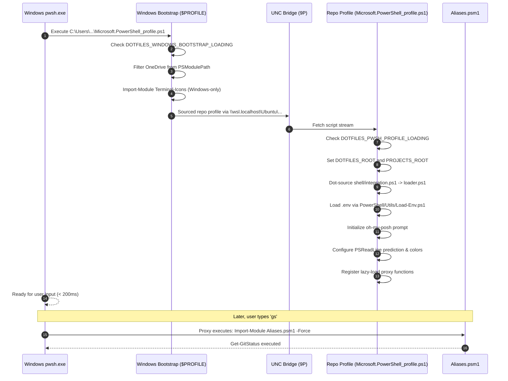

# Subsystem Guide: Cross-Platform Host Bridge & PowerShell 7 Subsystem

> **Layer:** 3 (Subsystem Decomposition)  
> **Subsystem:** PowerShell 7 Engine & UNC Host Bridge  
> **Primary Source Artifacts:** `PowerShell/Microsoft.PowerShell_profile.ps1`, `scripts/setup-pwsh7.sh`, `shell/loader.ps1`, `shell/integration.ps1`, `PowerShell/Modules/Aliases/Aliases.psm1`  

---

## 1. Purpose
The Cross-Platform Host Bridge connects the Windows operating system terminal (`pwsh.exe`) to the developer configuration located inside WSL2. It allows a Windows developer to enjoy identical aliases, environment variables, themes, and git commands without maintaining two copies of dotfiles or fighting cross-host symlink permission issues.

---

## 2. Responsibilities
- Dynamically locating the WSL distribution and resolving the Universal Naming Convention (UNC) path: `\\wsl.localhost\<distro>\home\<user>\dotfiles`.
- Managing the disposable Windows bootstrap profile (`$PROFILE`) at `C:\Users\<user>\OneDrive\Documents\PowerShell\Microsoft.PowerShell_profile.ps1`.
- Sanitizing `$env:PSModulePath` to purge cloud-synced (OneDrive) module directories that cause sluggishness and path conflicts.
- Guaranteeing strict host isolation: loading Windows-native modules (such as `Terminal-Icons`) exclusively on Windows, while preventing XML parser crashes when accessed from WSL.
- Providing sub-200ms startup times via lazy-loading proxy stubs for the heavy `Aliases.psm1` module.

---

## 3. Non-Responsibilities
- **Direct WSL Command Execution:** Windows PowerShell does not automatically run Linux ELF binaries; it executes PowerShell scripts that run inside the Windows `pwsh.exe` process.
- **POSIX Shell Configuration:** Bash and Zsh configurations are handled separately by the Shell Loader engine.

---

## 4. Position in the System
- **Called by:**
  - Windows Terminal launching PowerShell 7
  - VS Code integrated terminal on Windows
  - WSL `pwsh` (when PowerShell 7 is run inside Linux)
- **Calls:**
  - `shell/integration.ps1`
  - `shell/loader.ps1`
  - `PowerShell/Utils/Load-Env.ps1`
  - `PowerShell/Modules/Aliases/Aliases.psm1` (on-demand)
  - `oh-my-posh` (binary CLI)

---

## 5. Core Abstractions

### 1. The Two-Profile Model
```
┌────────────────────────────────────────────────────────────────────────┐
│ 1. Windows Bootstrap Profile ($PROFILE.CurrentUserCurrentHost)         │
│    Location: C:\Users\...\Documents\PowerShell\Microsoft.PowerShell_profile.ps1 │
│    - Managed by: scripts/setup-pwsh7.sh (via template heredoc)         │
│    - Role: Resolves UNC root, strips OneDrive, imports Terminal-Icons   │
│    - Status: Disposable / Auto-regenerated                             │
└───────────────────────────────────┬────────────────────────────────────┘
                                    │ dot-sources via UNC path
                                    ▼
┌────────────────────────────────────────────────────────────────────────┐
│ 2. Canonical Repo Profile                                              │
│    Location: \\wsl.localhost\Ubuntu\home\sprime01\dotfiles\PowerShell\... │
│    - Managed by: Git version control                                   │
│    - Role: Full developer cockpit, modules, aliases, themes            │
│    - Status: Authoritative / Cross-host                                │
└────────────────────────────────────────────────────────────────────────┘
```

### 2. Lazy-Load Proxy Functions
Instead of importing `Aliases.psm1` (which defines 25+ cmdlets and takes 800ms to parse), the repo profile generates lightweight proxy stubs:
```powershell
function finddir { Import-Module $aliasesModulePath -Force; Find-Directory @args }
function gs      { Import-Module $aliasesModulePath -Force; Get-GitStatus @args }
function ports   { Import-Module $aliasesModulePath -Force; Test-Port @args }
```
When `gs` is invoked for the first time:
1. `Import-Module Aliases.psm1 -Force` executes.
2. The real cmdlet overrides the stub in memory.
3. Subsequent calls execute natively without overhead.

### 3. Loop and Re-entry Guards
To prevent infinite recursion when nested shells or child processes run:
- `$env:DOTFILES_WINDOWS_BOOTSTRAP_LOADING` / `_LOADED`
- `$env:DOTFILES_PWSH_PROFILE_LOADING` / `_LOADED`
- `$env:DOTFILES_MODULAR_PWSH_LOADING`

---

## 6. Internal Operation: Windows Startup Trace



---

## 7. State
- **State Read:**
  - Windows environment: `$IsWindows`, `$IsLinux`, `$env:USERPROFILE`, `$env:WSL_DISTRO_NAME`.
  - Files: `.env` and `mcp/.env` (parsed via `Load-Env.ps1`).
- **State Modified:**
  - Environment variables: `$env:DOTFILES_ROOT`, `$env:PROJECTS_ROOT`, `$env:PATH`.
  - PowerShell session: Functions, aliases, PSReadLine options, prompt engine.

---

## 8. Invariants & Why They Matter

| Invariant | Enforcing Mechanism | Consequence of Violation |
| :--- | :--- | :--- |
| **Terminal-Icons is Windows-Only** | `$IsWindows -and $PSVersionTable.PSEdition -eq 'Core'` guard in bootstrap | `Import-Clixml` fails in WSL `pwsh` with dictionary key XML error, crashing startup. |
| **UNC paths instead of Symlinks** | `scripts/setup-pwsh7.sh` generates UNC paths | Windows Developer Mode symlink elevation errors; broken paths across reboots. |
| **OneDrive scrubbing** | RegEx filter in Windows bootstrap | PowerShell loads outdated duplicate modules from OneDrive sync cache. |
| **Aliases.psm1 lazy loading** | Proxy stubs at bottom of repo profile | Cold startup latency increases from 200ms to >1200ms. |

---

## 9. Failure Modes & Diagnostics

| Symptom | Probable Cause | Diagnostic Evidence | Recovery Path |
| :--- | :--- | :--- | :--- |
| `Cannot find path \\wsl.localhost\...` | WSL2 is shutdown or distro name changed | `Test-Path \\wsl.localhost\Ubuntu\...` returns False | Run `wsl -l -v` in Windows; regenerate profile with `just setup-pwsh7` |
| `Import-Clixml: Name attribute...` | Terminal-Icons loaded inside WSL | Error in WSL `pwsh` console pointing to Terminal-Icons | Ensure Terminal-Icons is loaded ONLY in the Windows bootstrap profile |
| `Cannot overwrite existing alias` | Conflicting native alias (e.g. `g` or `curl`) | `Get-Alias <name>` shows conflict | Aliases module uses `Set-Alias -Force` or removes conflicting alias first |

---

## 10. Extension Points
- **Adding PowerShell Cmdlets:**
  1. Add the cmdlet script in `PowerShell/Modules/Aliases/<Verb-Noun>.ps1`.
  2. Add the function declaration to `PowerShell/Modules/Aliases/Aliases.psm1`.
  3. Run `updatealiases` or execute `PowerShell/Modules/Aliases/Update-AliasesModule.ps1` to automatically regenerate proxy stubs in the repo profile.
- **Adding Oh My Posh Themes:** Add `.omp.json` theme files to `PowerShell/Themes/` and select them via `settheme <name>`.

---

## 11. Source Trail
- `scripts/setup-pwsh7.sh` — Windows PowerShell 7 profile generator
- `PowerShell/Microsoft.PowerShell_profile.ps1` — Authoritative repository profile
- `shell/integration.ps1` — Modular PowerShell bridge and guard
- `shell/loader.ps1` — 5-stage PowerShell configuration loader
- `PowerShell/Modules/Aliases/Aliases.psm1` — Developer cmdlet library
- `PowerShell/Modules/Aliases/Update-AliasesModule.ps1` — Proxy stub generator
- `PowerShell/Utils/Load-Env.ps1` — Key-value `.env` parser for PowerShell
- `test/test-powershell-aliases.ps1` — Test suite for PowerShell alias module
- `test/test-powershell-theme.ps1` — Test suite for Oh My Posh theme engine
