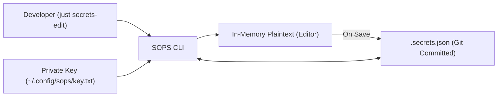

# Subsystem Guide: Security, Secrets & Packaging

> **Layer:** 3 (Subsystem Decomposition)  
> **Subsystem:** Secret Encryption, Age Cryptography, Vault & Installer Verification  
> **Primary Source Artifacts:** `.sops.yaml`, `.secrets.json`, `tools/vault/*`, `lib/secure-install.sh`, `lib/constants.sh`  

---

## 1. Purpose
This subsystem protects sensitive developer credentials (API keys, SSH tokens, passwords) from exposure in version control, and defends the system against supply-chain and man-in-the-middle attacks during third-party tool installation.

---

## 2. Responsibilities
- Managing asymmetric encryption of secret files using SOPS and Age public/private key pairs.
- Providing convenient interactive workflows (`just secrets-edit`, `just secrets-view`, `just secrets-add`) for credentials.
- Optional enterprise HashiCorp Vault Agent integration for dynamic secret leasing.
- Enforcing HTTPS (TLS 1.2+) and cryptographic SHA256 checksum verification on all downloaded installation scripts via `lib/secure-install.sh`.

---

## 3. Non-Responsibilities
- **Long-term Public Key Distribution:** Age private keys are stored locally at `~/.config/sops/key.txt` and must be securely backed up by the user.
- **Root-level Privilege Management:** Does not manage OS root password policies.

---

## 4. Position in the System
- **Called by:**
  - `bootstrap.sh` (via `lib/secure-install.sh`)
  - `just secrets-edit`, `just secrets-view`, `just secrets-encrypt`, `just secrets-decrypt`
  - `tools/vault/*` recipes
- **Calls:**
  - `sops` (binary)
  - `age` / `age-keygen` (binary)
  - `vault` (binary, optional)

---

## 5. Core Abstractions

### 1. Age Encryption Engine (`.sops.yaml`)
Configured to match file paths and apply the user's Age public key:
```yaml
creation_rules:
  - path_regex: (^|/)\.env$
    age: age1mq5sj8gj4k5vqtgefkuvs05nghanzhgmcqkxxspk0vffq9hxm5ssnj93a5
  - path_regex: .*\.json$
    age: age1mq5sj8gj4k5vqtgefkuvs05nghanzhgmcqkxxspk0vffq9hxm5ssnj93a5
```
This allows `.secrets.json` to be safely committed directly to public or private Git repositories.

### 2. Secure Installer with Checksum Verification (`lib/secure-install.sh`)
Guarantees that third-party scripts downloaded from the web (e.g. Oh My Posh installer) match verified cryptographic hashes:
```bash
secure_install() {
    local url="$1"
    local expected_sha256="$2"
    # Downloads via TLS 1.2+
    # Calculates sha256sum
    # Compares against expected hash; aborts with exit code 2 if mismatch
}
```

---

## 6. Internal Operation: Secret Lifecycle



---

## 7. Failure Modes & Diagnostics

| Symptom | Probable Cause | Diagnostic Evidence | Recovery Path |
| :--- | :--- | :--- | :--- |
| `SOPS: error opening file: age: no identity found` | Missing Age private key | `~/.config/sops/key.txt` not found | Restore Age private key to `~/.config/sops/key.txt` |
| `Checksum verification failed!` | Remote script updated upstream | `sha256sum` does not match `lib/constants.sh` | Fetch new checksum via `bash lib/secure-install.sh fetch_checksum` |
| Secret committed in plaintext | Accidental `.env` git staging | `git status` shows untracked `.env` | `.gitignore_global` ignores `.env`; run `git rm --cached .env` |

---

## 8. Source Trail
- `.sops.yaml` — SOPS encryption pattern and public key manifest
- `.secrets.json` — Git-tracked encrypted secret repository
- `lib/secure-install.sh` — Cryptographic installer verification engine
- `lib/constants.sh` — Central installer URLs and SHA256 hashes
- `docs/how-to/SECRET_MANAGEMENT.md` — User guide for secrets
- `test/test-oh-my-posh-checksum.sh` — Checksum validation test suite
