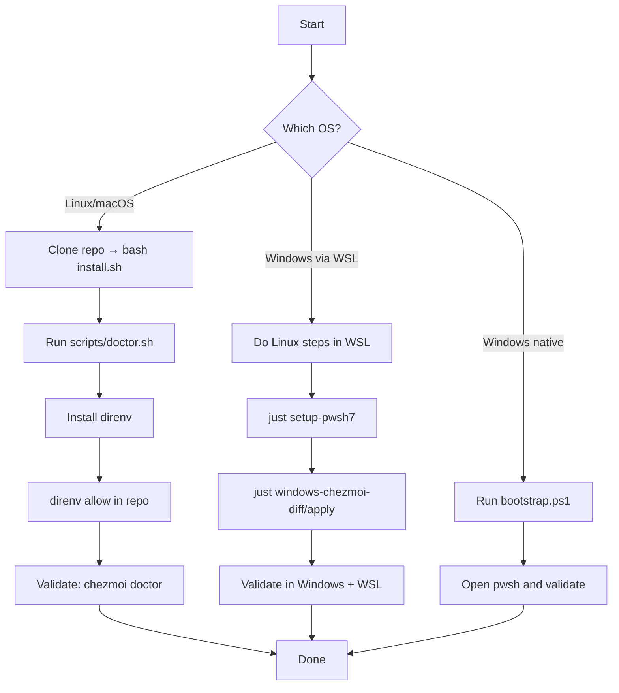

# New Machine Setup (Tutorial)

Audience: beginners to intermediate devs. Follow one path for your OS. Copy/paste the commands in order. Verify after each major step.

Before you begin

- Have Git and curl or wget available.
- Pick a projects directory (default is `~/projects`).

Linux and macOS

1) Clone and bootstrap
   ```bash
   git clone https://github.com/SPRIME01/dotfiles "$HOME/dotfiles"
   cd "$HOME/dotfiles"
   bash install.sh
   ```
   - When to use: first install.
   - Why it matters: installs chezmoi if missing; applies templates safely.

2) Validate environment
   ```bash
   bash scripts/doctor.sh           # basic checks (non-fatal unless --strict)
   CHEZMOI_NO_PAGER=1 PAGER=cat chezmoi doctor
   ```
   - When to use: right after bootstrap.
   - Why it matters: catches path/perm issues early.

3) Install direnv (choose one)
   ```bash
   # Project justfile (inside this repo)
   just install-direnv
   # or direct helper
   bash scripts/install-direnv.sh
   direnv version
   ```
   - When to use: once per machine.
   - Why it matters: direnv powers quiet, per-dir envs in this repo and future projects.

4) Enable direnv for this repo
   ```bash
   # Run in the repo root (where .envrc lives)
   direnv allow
   direnv status
   ```
   - When to use: first time; repeat after editing `.envrc`.
   - Why it matters: security model—environments load only after explicit allow.

5) Optional: verify shells
   ```bash
   # zsh: templates include direnv hooks and WSL/macOS PATH fixes
   zsh --version
   echo $SHELL
   ```
   - When to use: after switching shells.
   - Why it matters: ensures templates rendered as expected (see `dot_zshrc.tmpl`).

Windows (WSL integration recommended)

1) In WSL: clone, bootstrap, validate (same as Linux/macOS above).

2) Set up Windows PowerShell 7 to load this repo
   ```bash
   just setup-pwsh7
   ```
   - When to use: WSL + Windows.
   - Why it matters: your Windows PowerShell picks up the repo’s profile via a UNC path.

3) Diff/apply Windows‑side files managed by chezmoi (from WSL)
   ```bash
   just windows-chezmoi-diff
   just windows-chezmoi-apply
   ```
   - When to use: applying Windows-side changes (e.g., PowerShell profile) from WSL.
   - Why it matters: consistent management from one source of truth.
   - Note: If a helper fails, use the manual commands in docs/how-to/chezmoi-windows.md.

Windows (native PowerShell alternative)

1) Bootstrap PowerShell directly
   ```powershell
   Invoke-RestMethod https://raw.githubusercontent.com/SPRIME01/dotfiles/main/bootstrap.ps1 | Invoke-Expression
   ```
   - When to use: no WSL; configure PowerShell to load from this repo.

2) Validate
   ```powershell
   oh-my-posh --version
   $env:DOTFILES_ROOT
   ```

Verification checklist

- doctor passes or prints only optional warnings: `bash scripts/doctor.sh`
- chezmoi doctor shows no blocking issues: `chezmoi doctor`
- direnv loads quietly in this repo: `direnv status`
- zsh/bash load repo paths and aliases as expected.
- On WSL: new Windows PowerShell sessions show the Oh My Posh prompt and repo functions.

Flowchart: New machine setup



Safety and ordering

- Prefer diff before apply when unsure: `CHEZMOI_NO_PAGER=1 PAGER=cat chezmoi diff`.
- The repo whitelists what gets applied (see `.chezmoiignore`). Windows PowerShell profile is intentionally not directly applied; use the WSL/PowerShell helpers.
- Most scripts are idempotent; rerun safely if a step fails.

What next?

- How‑to: docs/how-to/use-chezmoi.md
- How‑to: docs/how-to/use-direnv.md
- Windows details: docs/how-to/chezmoi-windows.md and docs/how-to/windows.md

