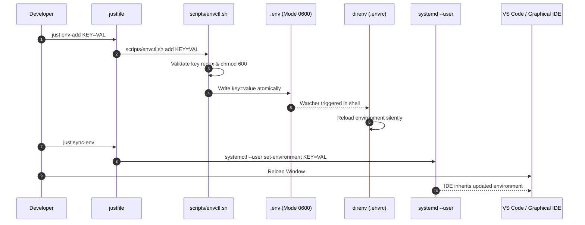

# Workflow: Environment Variable Lifecycle & GUI Sync

> **Layer:** 4 (Workflows & Execution Traces)  
> **Trigger:** Developer adding/updating a secret or environment variable  
> **Entry Point:** `just env-add KEY=VALUE` or `scripts/envctl.sh`  

---

## 1. Summary
This workflow traces how an environment variable moves from initial definition to active availability in CLI shells, background daemons, and graphical desktop applications (VS Code). Changes are written safely with permission guards (`0600`), reloaded dynamically by `direnv`, and exported to `systemd --user` for GUI processes.

---

## 2. Numbered Execution Sequence

1. **User Invocation:** Developer runs `just env-add API_KEY=secret123`.
2. **Input Validation (`scripts/envctl.sh`):**
   - Validates key format against regex `^[A-Za-z_][A-Za-z0-9_]*$`.
   - Ensures target `.env` exists with `chmod 600`.
3. **Atomic Modification:**
   - Appends or updates `API_KEY=secret123` in `.env` using atomic file replacement.
4. **Shell Ingestion:**
   - On the next prompt or subshell, `direnv` notices `.env` file change via `.envrc` watcher.
   - `direnv` silently reloads the environment without requiring shell restart.
5. **GUI Synchronization (Optional/On-Demand):**
   - Developer runs `just sync-env` (or executes `scripts/sync-env-to-systemd.sh`).
   - Sourced `scripts/export-to-systemd-env.sh` reads `.env` and executes:
     ```bash
     systemctl --user set-environment API_KEY="secret123"
     ```
6. **IDE Window Reload:**
   - Developer reloads VS Code window (`Ctrl+Shift+P` -> `Reload Window`).
   - VS Code processes and language servers inherit updated variables from systemd.

---

## 3. Sequence Diagram



---

## 4. Source Trail
- `scripts/envctl.sh`
- `scripts/sync-env-to-systemd.sh`
- `scripts/export-to-systemd-env.sh`
- `scripts/fix-env-perms.sh`
- `.envrc`
