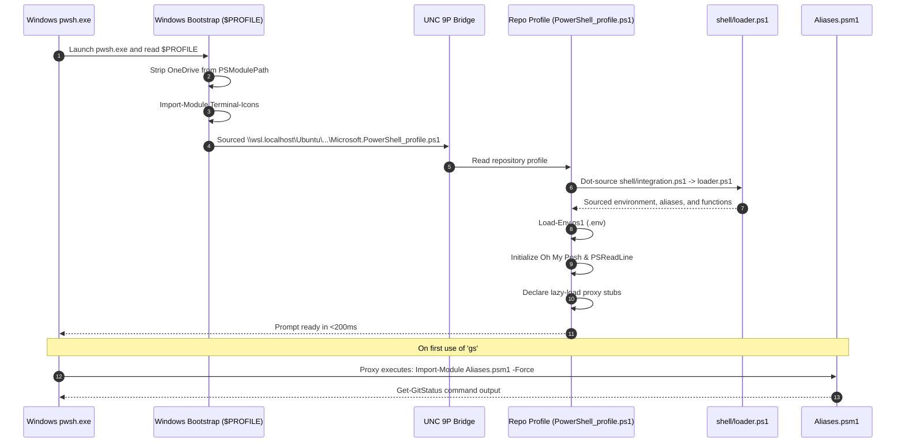

# Workflow: Windows PowerShell 7 Startup via UNC Bridge

> **Layer:** 4 (Workflows & Execution Traces)  
> **Trigger:** Opening Windows Terminal or VS Code on Windows running `pwsh.exe`  
> **Entry Point:** `C:\Users\<user>\OneDrive\Documents\PowerShell\Microsoft.PowerShell_profile.ps1`  

---

## 1. Summary
When PowerShell 7 starts on Windows, it executes the disposable bootstrap profile written by `scripts/setup-pwsh7.sh`. The bootstrap purges OneDrive from the module path, imports the Windows-only `Terminal-Icons` module, and reaches across the hypervisor via UNC (`\\wsl.localhost\Ubuntu\...`) to dot-source the authoritative repository profile. The repo profile loads environment variables, configures Oh My Posh, and declares lazy-loading proxies for the `Aliases.psm1` cmdlet library.

---

## 2. Numbered Execution Sequence

1. **Host Terminal Launch:** Windows Terminal executes `pwsh.exe` in the host Windows OS.
2. **Bootstrap Profile Execution:**
   - PowerShell executes `$PROFILE.CurrentUserCurrentHost` (`...Documents\PowerShell\Microsoft.PowerShell_profile.ps1`).
   - Checks `$env:DOTFILES_WINDOWS_BOOTSTRAP_LOADING` to prevent recursive re-entry.
3. **OneDrive Module Path Cleansing:**
   - Filters out paths matching `OneDrive\\.*\\PowerShell\\Modules` from `$env:PSModulePath` to prevent loading corrupted cloud copies.
4. **Windows-Native Module Import:**
   - If `$IsWindows` and `PSEdition -eq 'Core'`, imports `Terminal-Icons` (must be loaded in Windows, never over UNC).
5. **UNC Path Resolution & Bridging:**
   - Resolves `$distroPath = "\\wsl.localhost\Ubuntu\home\sprime01\dotfiles"`.
   - Fallback: Tries `\\wsl$\Ubuntu\...` if `\\wsl.localhost` is unsupported.
   - Dot-sources `$distroPath\PowerShell\Microsoft.PowerShell_profile.ps1`.
6. **Repo Profile Initialization:**
   - Sets `$env:DOTFILES_ROOT = $distroPath` and `$env:PROJECTS_ROOT`.
   - Dot-sources `shell/integration.ps1`, which invokes `shell/loader.ps1`.
   - `loader.ps1` dot-sources:
     - `shell/common/environment.ps1`
     - `shell/common/aliases.ps1`
     - `shell/common/functions.ps1`
     - `shell/platform-specific/windows.ps1`
     - `shell/powershell/config.ps1`
7. **Local Environment Loading:**
   - Dot-sources `PowerShell/Utils/Load-Env.ps1` to parse `.env` and `mcp/.env`.
8. **Prompt Theme & Terminal Polish:**
   - Executes `oh-my-posh init pwsh ... | Invoke-Expression`.
   - Configures `PSReadLine` predictive history and syntax highlighting.
9. **Lazy-Load Proxy Registration:**
   - Declares thin wrapper functions (`gs`, `finddir`, `ports`) that defer importing `Aliases.psm1` until explicitly called.

---

## 3. Sequence Diagram

---

## 4. Failure Branches
- **WSL Service Stopped:** If WSL is not running, accessing `\\wsl.localhost\` produces an immediate error. Diagnostic: `wsl -l -v`. Recovery: Start WSL by running `wsl` once, or execute `just setup-pwsh7`.
- **Terminal-Icons XML Crash:** If Terminal-Icons is loaded inside WSL `pwsh`, `Import-Clixml` fails. Recovery: Enforce `$IsWindows` check in bootstrap profile.

---

## 5. Source Trail
- `scripts/setup-pwsh7.sh`
- `PowerShell/Microsoft.PowerShell_profile.ps1`
- `shell/integration.ps1`
- `shell/loader.ps1`
- `PowerShell/Modules/Aliases/Aliases.psm1`
- `PowerShell/Utils/Load-Env.ps1`
- `test/test-powershell-aliases.ps1`
