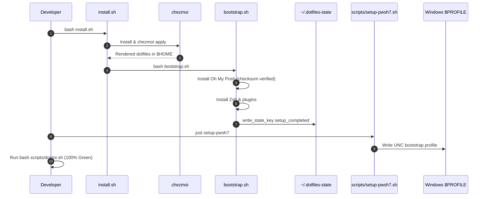

# Workflow: Machine Provisioning & Template Application

> **Layer:** 4 (Workflows & Execution Traces)  
> **Trigger:** Initial machine setup or periodic dotfile updates  
> **Entry Point:** `install.sh`, `bootstrap.sh`, `bootstrap.ps1`, `just setup-pwsh7`  

---

## 1. Summary
Provisioning establishes the complete developer cockpit on a fresh system. On Linux/WSL, `install.sh` ensures `chezmoi` is installed, clones the repository, and applies templates. `bootstrap.sh` then symlinks core configurations, installs Oh My Posh, and configures VS Code. Finally, `just setup-pwsh7` bridges the Windows host terminal to the WSL repository over UNC.

---

## 2. Numbered Execution Sequence

1. **Repository Setup:**
   ```bash
   git clone https://github.com/SPRIME01/dotfiles "$HOME/dotfiles"
   cd "$HOME/dotfiles"
   bash install.sh
   ```
2. **Chezmoi Initialization & Application:**
   - `install.sh` downloads `chezmoi` binary if missing.
   - Runs `chezmoi init --source="$HOME/dotfiles"`.
   - Evaluates `.chezmoiignore` whitelist and applies `dot_*.tmpl` files to `$HOME`.
3. **Shell Bootstrap Execution (`bootstrap.sh`):**
   - Links `.bashrc`, `.zshrc`, `.shell_common.sh`, `.shell_functions.sh`.
   - Downloads Oh My Posh via `lib/secure-install.sh` verifying SHA256 checksum.
   - Executes `install_zsh.sh` to install Oh My Zsh and plugins (syntax highlighting, autosuggestions).
   - Merges VS Code configuration via `install/vscode.sh`.
   - Writes completion timestamp to `~/.dotfiles-state` via `write_state_key "setup_completed"`.
4. **Windows Profile Bridge (`just setup-pwsh7`):**
   - Run from WSL inside Ubuntu.
   - Discovers Windows username via `pwsh.exe -Command '$env:USERNAME'`.
   - Resolves UNC path: `\\wsl.localhost\Ubuntu\home\sprime01\dotfiles`.
   - Writes disposable bootstrap profile to Windows `$PROFILE`.
5. **Verification:**
   - Run `bash scripts/doctor.sh` to confirm system health.

---

## 3. Sequence Diagram



---

## 4. Source Trail
- `install.sh`
- `bootstrap.sh`
- `bootstrap.ps1`
- `scripts/setup-pwsh7.sh`
- `lib/state-management.sh`
- `components.yaml`
- `test/test-bootstrap-idempotent.sh`
