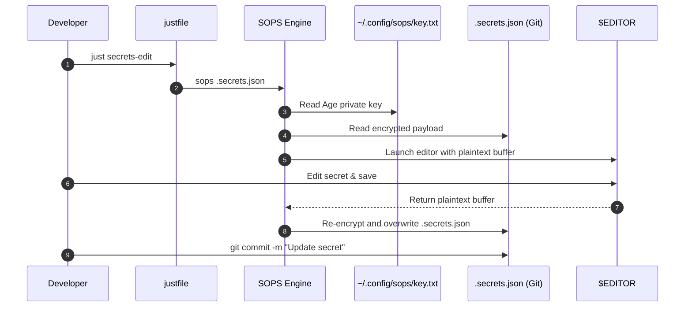

# Workflow: Secret Encryption, Decryption & Editing

> **Layer:** 4 (Workflows & Execution Traces)  
> **Trigger:** Developer adding or updating an encrypted secret in version control  
> **Entry Point:** `just secrets-edit` / `just secrets-view` / `just secrets-encrypt`  

---

## 1. Summary
This workflow traces the lifecycle of encrypted secrets committed to Git using SOPS and Age. Developers edit secrets in an ephemeral in-memory decrypted buffer; upon saving, SOPS re-encrypts the payload using the public key specified in `.sops.yaml`, allowing safe version control storage in `.secrets.json`.

---

## 2. Numbered Execution Sequence

1. **Edit Invocation:** Developer executes `just secrets-edit`.
2. **Identity Verification:**
   - SOPS checks for Age private key at `~/.config/sops/key.txt` or `$SOPS_AGE_KEY_FILE`.
3. **Decryption to Memory:**
   - SOPS reads `.secrets.json`, decrypts ciphertext using Age private key, and opens an ephemeral temporary file in `$EDITOR`.
4. **User Modification:**
   - Developer modifies keys or values and saves the file.
5. **Re-encryption:**
   - SOPS re-encrypts the modified JSON using the Age public key from `.sops.yaml`.
   - Overwrites `.secrets.json` with armored ciphertext.
6. **Git Staging:**
   - Developer stages and commits `.secrets.json` safely to Git (`git add .secrets.json && git commit`).

---

## 3. Sequence Diagram

---

## 4. Source Trail
- `.sops.yaml`
- `.secrets.json`
- `justfile`
- `docs/how-to/SECRET_MANAGEMENT.md`
