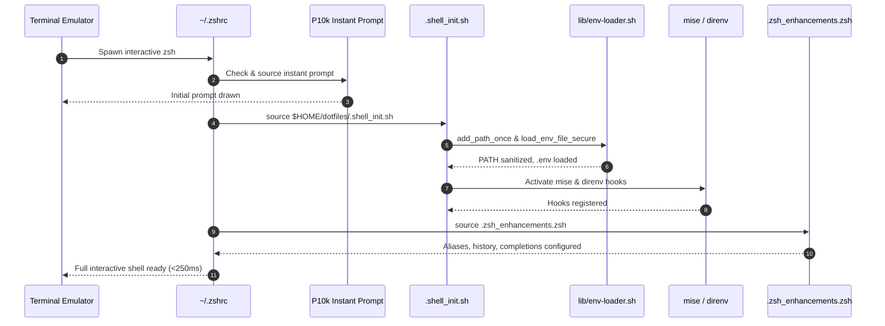

# Workflow: POSIX Shell Startup (`zsh` / `bash`)

> **Layer:** 4 (Workflows & Execution Traces)  
> **Trigger:** Opening an interactive terminal session in WSL2, Linux, or macOS  
> **Entry Point:** `~/.zshrc` (or `~/.bashrc`)  

---

## 1. Summary
When an interactive terminal opens, the shell sources its local dotfile (`~/.zshrc`), which initializes the Powerlevel10k instant prompt cache, derives `DOTFILES_ROOT`, and sources `.shell_init.sh` (or `shell/loader.sh`). The loader sets up essential paths, reads `.env` variables safely, registers aliases and shell functions, activates `mise` and `direnv` hooks, and renders the prompt in under 250 milliseconds.

---

## 2. Numbered Execution Sequence

1. **Terminal Launch:** Terminal emulator executes `/usr/bin/zsh` (or `bash`) with interactive flags.
2. **Instant Prompt Activation (Zsh only):**
   - `.zshrc` checks for `${XDG_CACHE_HOME:-$HOME/.cache}/p10k-instant-prompt-<user>.zsh`.
   - If present, sources it immediately to render the prompt before plugins load.
3. **Core Initialization:**
   - `.zshrc` checks for `$HOME/dotfiles/.shell_init.sh`.
   - Sourced script derives `DOTFILES_ROOT` safely:
     ```bash
     DOTFILES_ROOT="$(cd "$(dirname "${(%):-%x}")" 2>/dev/null && pwd)"
     ```
4. **Environment Configuration:**
   - Sourced `lib/env-loader.sh` sets `PROJECTS_ROOT` and checks `$WSL_DISTRO_NAME` to set `IS_WSL=1`.
   - `add_path_once` cleanly appends `~/.local/bin`, `~/.cargo/bin`, `~/.bun/bin` to `$PATH`.
   - `load_env_file_secure` reads `.env` line by line without `eval`.
5. **Tool Activation:**
   - `mise`: Checks if `mise` is in `$PATH`; runs `eval "$(mise activate zsh)"`.
   - `direnv`: Checks if `direnv` is in `$PATH`; runs `eval "$(direnv hook zsh)"` and silences logging (`DIRENV_LOG_FORMAT=""`).
6. **Alias & Function Loading:**
   - Sourced `.shell_enhancements.zsh` (or `shell/common/aliases.sh` and `functions.sh`).
   - Sets history configuration (`HISTSIZE=50000`, `SHARE_HISTORY`, `INC_APPEND_HISTORY`).
   - Sets completions (`zstyle ':completion:*' menu select`).
7. **Local Overrides:**
   - If `~/.zshrc.local` exists, sources it for private, unversioned overrides.
8. **Optional Performance Profiling:**
   - If `DOTFILES_PROFILE=1`, invokes `zmodload zsh/zprof` and outputs function execution timing.

---

## 3. Sequence Diagram



---

## 4. State Changes
- **Environment:** `$DOTFILES_ROOT`, `$PROJECTS_ROOT`, `$IS_WSL`, and `$PATH` exported.
- **Process Memory:** Aliases (`gs`, `cddot`, `projects`, etc.) and helper functions registered.
- **Shell Options:** `AUTO_CD`, `EXTENDED_GLOB`, `SHARE_HISTORY` enabled.

---

## 5. Failure Branches
- **Missing `install_zsh.sh` dependencies:** If `oh-my-zsh.sh` is missing, `.zshrc` gracefully falls back to standard Zsh options without crashing (`source "$ZSH/oh-my-zsh.sh" 2>/dev/null || true`).
- **Corrupted `.env` file:** Syntax errors in `.env` are skipped line-by-line by `load_env_file_secure` rather than terminating the shell.

---

## 6. Source Trail
- `.zshrc` / `dot_zshrc.tmpl`
- `.shell_init.sh`
- `lib/env-loader.sh`
- `.zsh_enhancements.zsh`
- `tools/measure-startup.sh`
