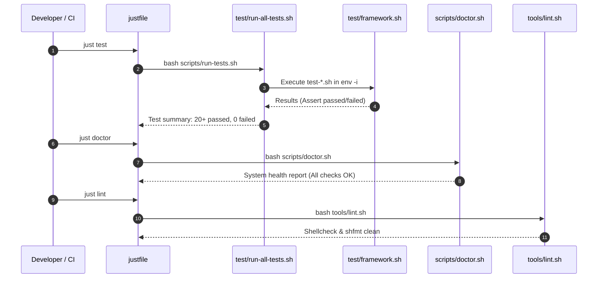

# Workflow: Automated Testing & Health Diagnostics

> **Layer:** 4 (Workflows & Execution Traces)  
> **Trigger:** Developer running verification before commit, or CI pull request pipeline  
> **Entry Point:** `just test`, `just doctor`, `just lint`  

---

## 1. Summary
This workflow traces how quality and security invariants are enforced across the codebase. Tests run inside isolated subshells (`env -i`) using `test/run-all-tests.sh` to prevent host environment pollution. In parallel, `scripts/doctor.sh` audits paths, binaries, and permissions, while `tools/lint.sh` enforces static code style with `shellcheck` and `shfmt`.

---

## 2. Numbered Execution Sequence

1. **User Invocation:** Developer runs `just test`.
2. **Runner Initialization (`test/run-all-tests.sh`):**
   - Discovers all `test/test-*.sh` and `test/*.ps1` files.
3. **Execution in Sanitized Subshells:**
   - For each shell test script:
     ```bash
     output="$(env -i HOME="$HOME" PATH="$PATH" DOTFILES_ROOT="$REPO_ROOT" bash "$test_script" 2>&1)"
     ```
   - Sourced `test/framework.sh` evaluates assertions (`test_assert`, `test_assert_contains`).
4. **PowerShell Test Execution:**
   - If `pwsh` is available, runs `pwsh -NoProfile -File test/*.ps1`.
5. **Static Code Quality Gate (`just lint`):**
   - `tools/lint.sh` discovers all shell scripts in the repository.
   - Runs `shellcheck` across all files.
   - Runs `shfmt -d` to verify formatting.
6. **Diagnostic Health Audit (`just doctor`):**
   - Executes `scripts/doctor.sh`.
   - Checks `$DOTFILES_ROOT`, required binaries (`git`, `chezmoi`, `direnv`, `mise`), permissions on `.env` (`0600`), and gitignore rules.

---

## 3. Sequence Diagram



---

## 4. Source Trail
- `justfile`
- `scripts/run-tests.sh`
- `test/run-all-tests.sh`
- `test/framework.sh`
- `scripts/doctor.sh`
- `tools/lint.sh`
